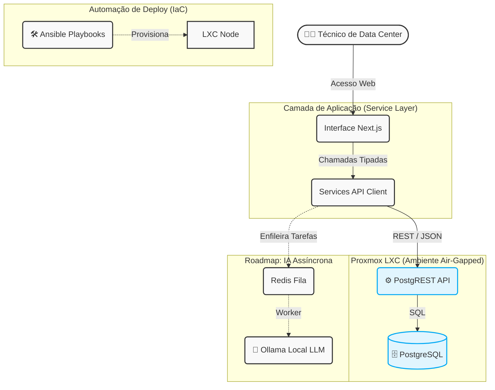

# 🌐 InfraVision - Data Center Infrastructure Management

**InfraVision** é uma aplicação web moderna (DCIM) projetada para visualização, gestão e automação detalhadas de infraestrutura de TI em ambientes de missão crítica.

---

## 🚀 Sobre o Projeto
O sistema permite que operadores e gestores visualizem a disposição física através de uma **planta baixa interativa**, gerenciem o inventário com **visão gráfica de racks** e controlem acessos proativamente. 

## 🏗️ Arquitetura do Sistema

O projeto utiliza o padrão de **Service Layer** no frontend para comunicar-se diretamente com o **PostgreSQL** através do **PostgREST**, garantindo alta velocidade e segurança de tipos (Type Safety).


> **Filosofia:** Priorizamos a estabilidade, a segurança e a independência. Um sistema funcional, robusto e **100% self-hosted** é mais importante que dependências de nuvens de terceiros.

## 📚 Documentação Detalhada
Consulte os documentos técnicos para entender a arquitetura a fundo:
- 🏗️ [**ARCHITECTURE.md**](ARCHITECTURE.md) - Visão geral e Tech Stack.
- 📅 [**DAILY.md**](DAILY.md) - Diário de bordo e metas.
- 📋 [**CHANGELOG.md**](CHANGELOG.md) - Histórico de atualizações.

## 🛠️ Stack Tecnológica (Self-Hosted)
- **Frontend:** [Next.js 15](https://nextjs.org/) (App Router) + [TypeScript](https://www.typescriptlang.org/)
- **UI & Style:** [Tailwind CSS](https://tailwindcss.com/) + [ShadCN/UI](https://ui.shadcn.com/)
- **Base de Dados:** [PostgreSQL](https://www.postgresql.org/) (Container Isolado)
- **API REST:** [PostgREST](https://postgrest.org/) (Backend veloz e leve)
- **Armazenamento de Ficheiros (S3):** [MinIO](https://min.io/) (Object Storage Self-Hosted)
- **Autenticação:** [NextAuth.js](https://next-auth.js.org/) (Credenciais Locais)
- **Infraestrutura (IaC):** Ansible, Docker Compose e Proxmox LXC.

---

## ⚙️ Infraestrutura como Código (IaC) e Automação
O InfraVision foi desenhado para ser "Plug and Play" em qualquer ambiente virtualizado. Na pasta `ansible/`, encontrará os nossos scripts de provisionamento inteligente.

O que os scripts automatizam:
1. **Setup do Motor:** Instala dependências básicas e o Docker Compose no servidor.
2. **Segurança Zero-Touch:** Gera chaves criptográficas de sessão (NextAuth Secret) dinamicamente no momento da instalação.
3. **Deploy da Stack:** Clona o repositório, configura a base de dados PostgreSQL com auto-seed, levanta a API PostgREST e realiza o build do painel Next.js.
4. **Gestão Contínua:** Cria um script `deploy.sh` na raiz do servidor para futuras atualizações de código com apenas um comando.

### 🐳 Como realizar o Deploy Automatizado

Oferecemos duas abordagens de IaC dependendo da sua infraestrutura:

#### Opção A: Deploy Nativo no Proxmox (LXC)
Se utiliza um cluster Proxmox, o script cria a máquina do zero, alocando recursos e IP automaticamente.
1. Aceda ao terminal do Proxmox e clone o repositório.
2. Entre na pasta de infraestrutura e prepare o seu ficheiro:
```bash   
   cd ansible
   cp deploy_infravision.example.yaml deploy_infravision.yaml
 ```  
3. Execute o playbook e responda às perguntas interativas:
```bash    
    ansible-playbook deploy_infravision.yaml 
```

#### Opção B: Qualquer Servidor Linux (VMware, AWS, Hyper-V, Bare-Metal)
Se já possui um servidor Ubuntu/Debian criado em qualquer cloud ou hypervisor:
1. Na sua máquina local (onde tem o Ansible instalado), clone o repositório.
2. Entre na pasta e prepare o ficheiro genérico:
```bash
cd ansible
cp deploy_generic_linux.example.yaml deploy_generic_linux.yaml
```
3. Execute o playbook apontando para o IP do seu servidor remoto:
```bash
ansible-playbook -i 192.168.1.100, deploy_generic_linux.yaml --user root --ask-pass
```
Em ambos os casos, aguarde alguns minutos e o seu DCIM estará a correr na porta 3000!


## 💻 Desenvolvimento Local
Se deseja apenas correr o projeto na sua máquina para testes ou desenvolvimento de novas funcionalidades:
```bash
# 1. Instale as dependências
npm install

# 2. Configure o ambiente
cp .env.example .env # Preencha com as senhas locais para a DB e o NextAuth Secret

# 3. Inicie os containers da base de dados e API (Requer Docker)
docker compose up -d db api

# 4. Rode o servidor de desenvolvimento
npm run dev
```

## 🔒 Destaques Técnicos
1. **100% Air-Gapped Ready:** Nenhuma dependência de serviços externos no runtime.

2. **IaC (Infrastructure as Code):** Deploy automatizado em containers LXC via Ansible, criando o ambiente, banco de dados e usuários de forma autônoma.

3. **Type-Safe CRUD:** Interfaces Zod e TypeScript mapeadas 1:1 com o schema do banco de dados, resultando em zero erros de compilação (0 implicit any).


## 👨‍💻 Desenvolvedor Principal
**Davidson Santos Conceição**
Critical Mission Environment Operations Resident
🏢 Empresa: Fundamentos Sistemas (Alocado na TIM)
**📞 Contatos:**
📧 E-mails:
davidson.conceicao@fundamentos.com.br
dconceicao_fundamentos@timbrasil.com
**davidson.php@gmail.com**
 +55 (12) 99732-4548 / (91) 98426-0688 / (73) 99119-9676
Atualizado em 30/03/2026 por davidson.dev.br
